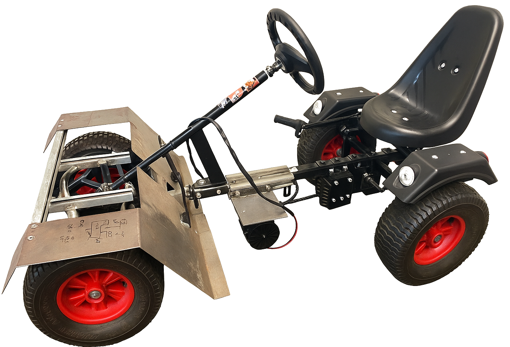

# JCS-BK_1091_GO-KART_Blinker_Lenkrad_Anzeige

Die gesamte Dokumentation befindet sich unter `docs/pdf/JCS-BK_1091_GO-KART_Blinker_Lenkrad_Anzeige_Dokumentation_DeanS.pdf` gefunden werden.

# Abstract

For several years, students at the technical high school have been working on upgrading a go-kart by
integrating systems typically found in modern cars. The individual modules communicate via a CAN
bus network, similar to that used in real vehicles. Two microcontrollers from the AVR family are used
throughout the system. The task is devided into multiple projects − one for each student.
This document describes the development of the light modules and the cockpit module. There is also a
video showcasing the development. The lighting system consists of four modules, one for each corner
of the vehicle. The two front modules support upper beam, lower beam, and daytime running lights,
while the two rear modules provide tail, brake, and reverse lights.
The cockpit module includes a display, a horn, and several buttons mounted on the steering wheel. It
serves as the central interface between the driver and the vehicle systems. The display presents
information such as speed, battery charge, current gear, light status, and other relevant data. Using the
steering wheel buttons and switches, the driver can control things like the driving direction, light
mode, blinker direction, horn and gear.
All required tasks of this project were successfully completed. The service provider (TIO) did not
finish the Java-based frontend; however, the serial communication interface has already been
implemented. Since the other projects have not yet integrated CAN bus communication into their
modules, communication between the cockpit and the other systems is currently not possible. In
addition, a 3D-printed case for the display and caps for the buttons could be developed in the future.

# Kurzfassung

Seit mehreren Jahren arbeiten Schüler der gymnasialen Oberstufe Bereich Technik daran, ein Go-Kart
durch die Integration von Systemen, die typischerweise in modernen Autos zu finden sind,
aufzurüsten. Die einzelnen Module kommunizieren über CAN-Bus, ähnlich wie es in echten
Fahrzeugen verwendet wird. Im gesamten System kommen zwei Mikrocontroller aus der AVR-Familie
zum Einsatz. Die Aufgabe ist in mehrere Projekte unterteilt – eines für jeden Schüler.
Dieses Dokument beschreibt die Entwicklung der Lichtanlage, des Lenkrads und der Tachoanzeige.
Des weiteren gibt es ein Video in dem die Entwicklung gezeigt wird. Die Lichtanlage besteht aus vier
Modulen, eines für jede Ecke des Fahrzeugs. Die beiden vorderen Module unterstützen Fernlicht,
Abblendlicht und Tagfahrlicht, während die beiden hinteren Module Rücklicht, Bremslicht und
Rückfahrlicht liefern.
Das Cockpitmodul umfasst ein Display, eine Hupe und mehrere am Lenkrad angebrachte Taster. Es
dient als zentrale Schnittstelle zwischen dem Fahrer und den Fahrzeugsystemen. Das Display zeigt
Informationen wie Geschwindigkeit, Batterieladestand, aktueller Gang, Lichtstatus und andere
relevante Daten an. Mit den Tasten und Schaltern am Lenkrad kann der Fahrer beispielsweise die
Fahrtrichtung, den Lichtmodus, die Blinkerrichtung, die Hupe und den Gang steuern.
Alle gegebenen Aufgaben dieses Projekts wurden erfolgreich abgeschlossen. Der Dienstleister (TIO)
hat das Java-basierte Frontend nicht fertiggestellt, jedoch wurde die serielle Schnittstelle bereits
implementiert. Da die anderen Projekte die CAN-Bus-Kommunikation noch nicht in ihre Module
integriert haben, ist eine Kommunikation zwischen dem Cockpit und den anderen Systemen derzeit
nicht möglich. Darüber hinaus könnte in Zukunft ein 3D-gedrucktes Gehäuse für das Cockpit und
Kappen für die Lenkrad-Taster entwickelt werden.

# Credits

Dieses Projekt verwendet AVR-Bibliotheken, darunter:

- Eine verbesserte Version von [dergraaf/avr-can-lib](https://github.com/dergraaf/avr-can-lib)
  welche auf den ATmega16M1 angepasst wurde.
- USART Bibliothek [jnk0le/AVR-UART-lib](https://github.com/jnk0le/AVR-UART-lib)
